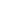

<div align="center">

# 🎧 AudioSwitcher

**A tiny, fast Windows CLI to list and switch your default audio devices — from the terminal.**

No GUI clicking, no settings panels. Just `as set --playback "Headphones"` and you're done.


[](https://github.com/GabrieleCastellani/as-audio-switcher/actions/workflows/ci.yml)


</div>

---

<div align="center">
  
</div>

## ✨ Highlights

- 🔊 **List** every active playback & recording device, with the current **Default** and **Communications** defaults clearly marked.
- ⚡ **Switch** the default output/input device by full name, partial name, or device ID — case-insensitive.
- 🎚️ **Two default slots, your choice** — target the multimedia **Default Device**, the **Communications** device, or both at once.
- 🖥️ **Interactive picker** — a guided two-column TUI that builds the exact command line for you to copy into scripts.
- 📦 **Single native binary** — Native AOT produces a ~3 MB `as.exe` with **zero .NET runtime dependency**.

## 📑 Table of contents

- [Demo](#-demo)
- [Install](#-install)
- [Quick start](#-quick-start)
- [Commands](#-commands)
  - [`as list`](#as-list)
  - [`as set`](#as-set)
  - [`as interactive`](#as-interactive)
- [How Windows defaults work](#-how-windows-defaults-work)
- [Build from source](#-build-from-source)
- [Tests](#-tests)
- [Releases (CI)](#-releases-ci)
- [Project structure](#-project-structure)
- [License](#-license)

## 🎬 Demo

```text
> as list --playback

🔊 Playback devices
╭───┬──────────────────────────────────┬──────────┬─────────┬───────┬─────────────────╮
│ # │ Device                           │ Type     │ Default │ Comms │ ID              │
├───┼──────────────────────────────────┼──────────┼─────────┼───────┼─────────────────┤
│ 1 │ Headset Earphone (Jabra Link 380)│ Playback │ ●       │ ●     │ {0.0.0...}.{7b… │
│ 2 │ LG HDR DQHD (NVIDIA HD Audio)    │ Playback │         │       │ {0.0.0...}.{90… │
│ 3 │ Speakers (Realtek(R) Audio)      │ Playback │         │       │ {0.0.0...}.{33… │
╰───┴──────────────────────────────────┴──────────┴─────────┴───────┴─────────────────╯
```

```powershell
> as set --playback "Speakers" --recording "Headset Mic"
Switched playback default and communications device to Speakers
Switched recording default and communications device to Headset Mic
```

## 📥 Install

Grab `as.exe` from the [latest release](../../releases/latest) and drop it anywhere on your `PATH`.
It's a single self-contained executable — **nothing else to install**.

```powershell
# verify it runs
as --version
```

> 💡 Prefer building it yourself? See [Build from source](#-build-from-source).

## 🚀 Quick start

```powershell
as                                                   # launch the interactive picker
as list                                              # list playback + recording devices
as set --playback "Headphones"                       # set the default playback device
as set --recording "USB Microphone"                  # set the default recording device
as set --playback "Headphones" --recording "USB Mic" # set both in one go
as set --playback "Headset" --communications         # set only the comms default
as set --playback "Speakers" --default               # set only the multimedia default
```

Device matching is **case-insensitive** and accepts a full name, a partial name, or the device ID.

## 🧭 Commands

### `as list`

Lists active devices and marks the current **Default** (`●`) and **Comms** (`●`) defaults.

| Option        | Description                         |
| ------------- | ----------------------------------- |
| `--playback`  | List only playback (output) devices |
| `--recording` | List only recording (input) devices |

With no option, both playback and recording devices are listed.

### `as set`

Sets the default playback and/or recording device.

| Option                        | Description                                                  |
| ----------------------------- | ------------------------------------------------------------ |
| `--playback <name>`           | Name or ID of the playback (output) device to set            |
| `--recording <name>`          | Name or ID of the recording (input) device to set            |
| `--communications`, `--comms` | Set only the default **communication** device                |
| `--default`                   | Set only the **multimedia** default (Console + Multimedia)   |

Provide `--playback`, `--recording`, or both. If neither `--communications` nor
`--default` is given, **every role is set at once**.

### `as interactive`

> Aliases: `as i` — or just run `as` with **no arguments**.

A guided, keyboard-driven picker:

1. **Pick what to change** — *Default device*, *Communication device*, or *Both*.
2. **Pick the devices** — a two-column screen (🔊 Playback · 🎙 Recording). Navigate with
   `↑/↓`, switch columns with `←/→` or `Tab`, and pick *— leave unchanged —* to skip a column.
3. **Copy the command** — a live panel composes the exact CLI command, e.g.
   `as set --playback "Headset Earphone" --recording "Headset Microphone" --communications`,
   ready to paste into a script.
4. Press `Enter` to apply (and print the final command) or `Esc` to go back.

## 🪟 How Windows defaults work

Windows tracks **two independent default device slots** per data flow:

| Slot                          | Roles                  | Used by                                   |
| ----------------------------- | ---------------------- | ----------------------------------------- |
| **Default Device**            | Console + Multimedia   | Media playback, games, system sounds      |
| **Default Communication Device** | Communications      | Voice/calling apps (Teams, Discord, …)    |

Use `--default` to target the multimedia slot, `--communications` (`--comms`) for the
communications slot, or omit both to set every role at once.

## 🔧 Build from source

The project targets **.NET 10** and is configured for **Native AOT**
(`<PublishAot>true</PublishAot>`), so `dotnet publish` produces a single, fully native
`as.exe` (~3 MB) with **no .NET runtime dependency**.

```powershell
dotnet publish -c Release
```

The executable is written to:

```text
bin/Release/net10.0-windows/win-x64/publish/as.exe
```

### Prerequisites

Native AOT compiles and links to native code, so the **build machine** (not machines that
merely run `as.exe`) needs:

- The **Desktop development with C++** workload (MSVC `link.exe`), and
- The **Windows 11 SDK** (provides `advapi32.lib`, etc.).

Publish from a *Developer Command Prompt / Developer PowerShell for VS* (or run
`vcvars64.bat` first) so the linker can find the MSVC and Windows SDK libraries.

## 🧪 Tests

Unit tests live in [`AudioSwitcher.Tests/`](AudioSwitcher.Tests) (xUnit) and cover the pure
logic of the app: `CliFormat` (labels, icons, role-target resolution, the copy-pasteable
`set` command-line builder, and innermost-error extraction), device name/ID matching in
`AudioDeviceService` (exact wins over partial, ambiguous partial matches are rejected), the
reported version, and the interactive picker helpers (`Wrap`, `BuildItems`, `InitialCursor`).
The Core Audio COM layers require a real audio endpoint and are exercised manually.

```powershell
dotnet test AudioSwitcher.slnx
```

## 🚢 Releases (CI)

Pushing a semantic-version tag automatically builds, tests, and publishes `as.exe` via
[`.github/workflows/release.yml`](.github/workflows/release.yml), attaching the binary, a
zip, and SHA-256 checksums to a GitHub Release.

```powershell
git tag v1.0.0
git push origin v1.0.0
```

The workflow runs on `windows-latest` (which ships the MSVC toolchain and Windows SDK needed
for Native AOT), **gates the release on the test suite**, and derives the build version from
the tag. It can also be triggered manually from the **Actions** tab to validate a build
without creating a release.

## 🗂️ Project structure

The code is organised by responsibility:

| Path          | Contents                                                                                  |
| ------------- | ----------------------------------------------------------------------------------------- |
| `Interop/`    | Native Core Audio COM glue: `NativeEnums`, `NativeTypes`, `ComInterfaces`, `CoreAudio`.    |
| `Audio/`      | Device model and logic: `AudioDevice`, `RoleTarget`, `AudioDeviceService`.                 |
| `Cli/`        | Command-line layer: `CliRouter`, `CliFormat`, and the `List`/`Set`/`Interactive` commands. |
| `Program.cs`  | Entry point — hands the arguments to `CliRouter`.                                          |
| `AudioSwitcher.Tests/` | xUnit test project.                                                              |

## 📜 License

Released under the [MIT License](LICENSE). © 2026 Gabriele Castellani.

---

<div align="center">
<sub>Built for Windows with ❤️ and <a href="https://spectreconsole.net/">Spectre.Console</a> · Developed with <a href="https://github.com/features/copilot">GitHub Copilot</a> &amp; Claude Opus 4.8 · Inspired by <a href="https://github.com/naudio/NAudio">NAudio</a> · Native AOT</sub>
</div>
